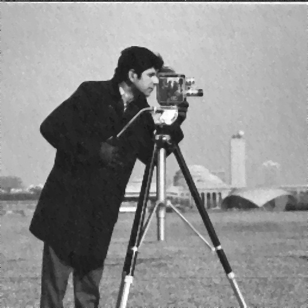
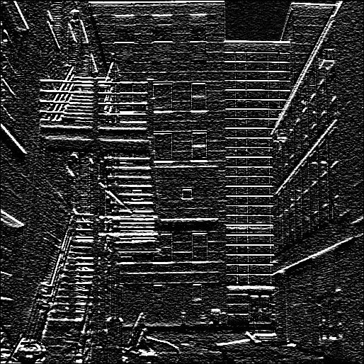
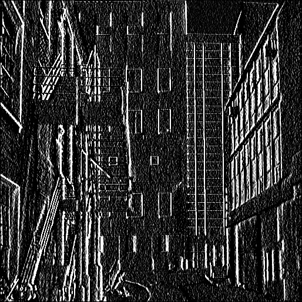
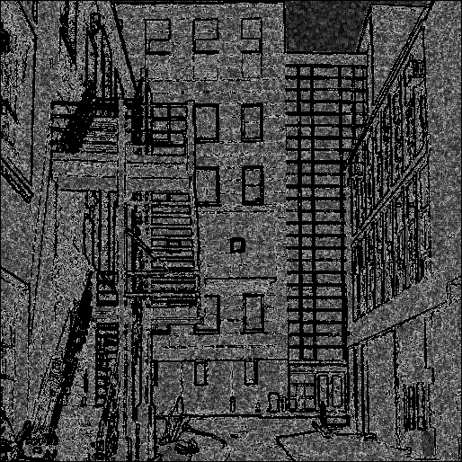

# Noise Removal & Edge Detection
This repo contains the sample code for a naive implementation of noise removal filters. The task is to remove noise on the input cameraman images in `images/` directory. There are 3 different cameraman images:
* `cameramanN1.jpg`: Image with Gaussian noise applied.
* `cameramanN2.jpg`: Image with salt-and-pepper noise applied.
* `cameramanN3.jpg`: Image with Gaussian and salt-and-pepper noise combined.

The main aim of this project is to understand basic spatial filtering methods, which is why the project implements naive versions of mean and median filters.

## Requirements
* Python 3.6.2
* OpenCV 3.3.0
* NumPy 1.13

## Noise Removal
The project implements three different noise rmeoval tehcniques, mean filter, median filter, and a combination of both. In order to run the code, you can simply ran `python noise_reduction.py`.

### Mean Filter
In mean filter, the idea is to update the brightness of a pixel by using its neighbor pixels' values. In order to implement this, a simple N×M unit matrix is constructed, and it is convoluted over the image, and the pixel that coresponds to the center of the kernel is updated with the mean of its neighbor' brightness values. A sample kernel can be thought as follows:

The kernel above is walked over the whole image, and the corresponding values are multiplied and summed, which is used to determine the value of the orange cell. This way, the resulting values are eliminating the pixels that do not fit to their surroundings, thus reducing the noise. The kernel size may be changed according to the given image; however, since mean filters cause blurring images, it is usually best to keep it not greater than 3×3. In this project, the kernel is the same as the image above. In each row in the table below, the images are with Gaussian noise, salt-and-pepper noise and the combination of both noises, respectively.

Original Image             |  Mean Filtered Image
:-------------------------:|:-------------------------:
  |  
  |  
  |  

### Median Filter
In median filter, there is a kernel as well; however, this kernel is not used to determine the mean of the neighbors. Instead, median of the values that correspond to the kernel is placed to the pixel in the center of the kernel. Since always the median will be selected, the outlier nodes usually do not affect the outputs, allowing them to be removed easily. Especially in outlier noises, such as salt-and-pepper noise, the noise is removed almost entirely from the image. However, this also introduces some sort of special effect like what a brush does to a painting, increasing the visibility of the edges. In this project, a 3×3 kernel is used for determining the median as well.

Original Image             |  Median Filtered Image
:-------------------------:|:-------------------------:
  |  
  |  
  |  

Especially in the second row of the table, the one with salt-and-pepper noise, the noise is removed almost completely. Even though this operation reduces the quality of the image, it may be suitable for some applications such as this image.

### Combined Balanced Filter
In order to operate on the mixed noises, as in the third cameraman image, there should be a better filter that deals with both of the noises adequately. To achieve this, a simple filter is constructed with the combination of the mean and median filters. Value of a pixel is determined as `0.2 * meanFilter(pixel) * 0.8 * medianFilter(pixel)` basically. By using this balanced formula, the filter is able to reduce both tyeps of the noise adequately; better than individual versions of those filters.

Original Image             |  Combined Filtered Image
:-------------------------:|:-------------------------:
  |  
  |  
  |  

## Edge Detection with Kirsch Compass Masks
In this part of the project, the main aim is to detect the edges using [Kirsch Compass masks](http://www.tutorialspoint.com/dip/Krisch_Compass_Mask.htm). The Kirsch Compass masks are basically a group of 8 different kernels that allows to understand the edges in 8 directions: North, North West, West, South West, South, South East, East, North East. The idea is to calculate the first derivative of the signal among the pixels, which is represented by the change in brightness, allowing to threshold some certain degrees of changes among the pixels, denoting edges on the image. The kernels are convoluted on the image, calculating the pixel values for the edge map. After the operation, resulting images are printed to screen using `cv2.imshow()` function of OpenCV, and also saved to the `outputs/convolution/` directory. The following two samples are for `NORTH` and `EAST` edge detection masks.

Original Image             |  NORTH Kirsch Compass Mask
:-------------------------:|:-------------------------:
  |  

Original Image             |  EAST Kirsch Compass Mask
:-------------------------:|:-------------------------:
  |  

With these samples, we are able to obtain different outputs for the edges on the image, grouped by direction.

### Constructing an Edge Map
Since the main aim of this whole process is to determine all of the edges, regardless of its orientation, an edge map should be constructed. In order to achieve this, for each pixel of the original image, the convolutions for each of the 8 directions are calculated, and the maximum of those 8 results is saved to an image. After saving these values, the image is filtered with a base threshold value, 200 in the project, in order to extract the visible edges of the image. The result of the process can be seen in table below.

Original Image             |  Edge Map of the Image
:-------------------------:|:-------------------------:
  |  

As seen in the edge map above, the processed image contains the edges on the image in black stripes, which is the expected achievement of the whole process.

## Overview
Since this project is based on a school project, the main aim of the project is to understand the basic methodologies used; therefore the performance of the project would not be the best. Therefore, some operations may take time; however, most places in the code have print statements that allows to track the current state of the program. All of the outputs are displayed and saved at the same time, which makes it simpler to check the results after running, or accessing them after using the program.

## License
This project is under MIT License.
